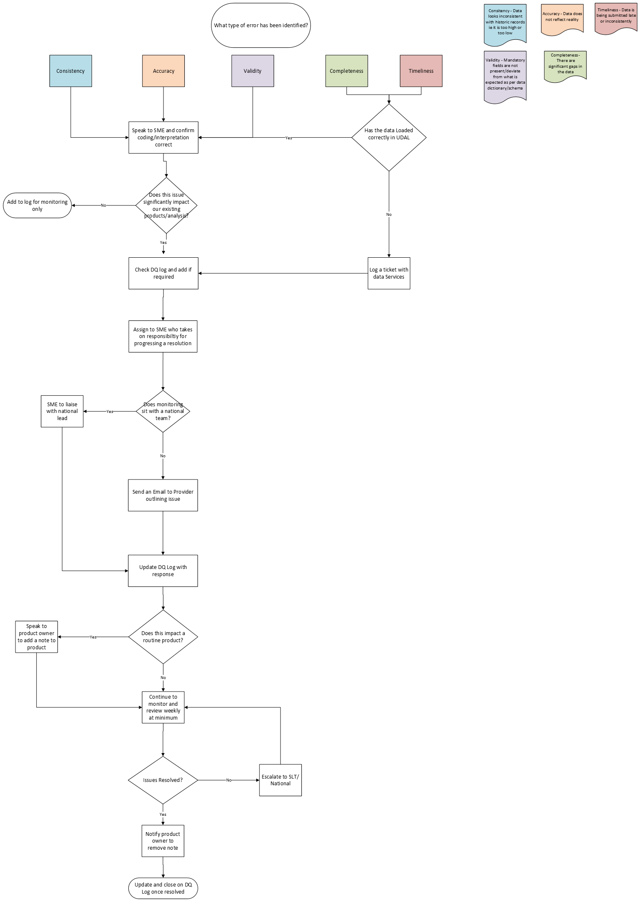

::: callout-important
---
title: "Data Quality Issues"
editor: visual
---
:::

If a data quality issue is discovered, please follow the data quality flow chart below.  

The log should also be referred to if any analysis is to be conducted on main data sets, so that any issues can be identified.  

This process allows an issue to be logged, so that relevant stakeholders can be identified and that any problems that may affect your or others analysis can be shared.  

::: {.callout-important appearance="default" icon="true"}
## Data Quality Log

The link to the data quality log excel sheet is here. [Data Quality Log](https://nhs.sharepoint.com/:x:/r/sites/InsightsIntelligenceteam/_layouts/15/Doc.aspx?sourcedoc=%7BC220BC09-1A6B-44A2-A177-D3AABFFB5374%7D&file=Data%20Quality%20log.xlsm&action=default&mobileredirect=true)  

You will need access to the I&I team SharePoint in order to access this file.  
:::

## Data Quality Process

